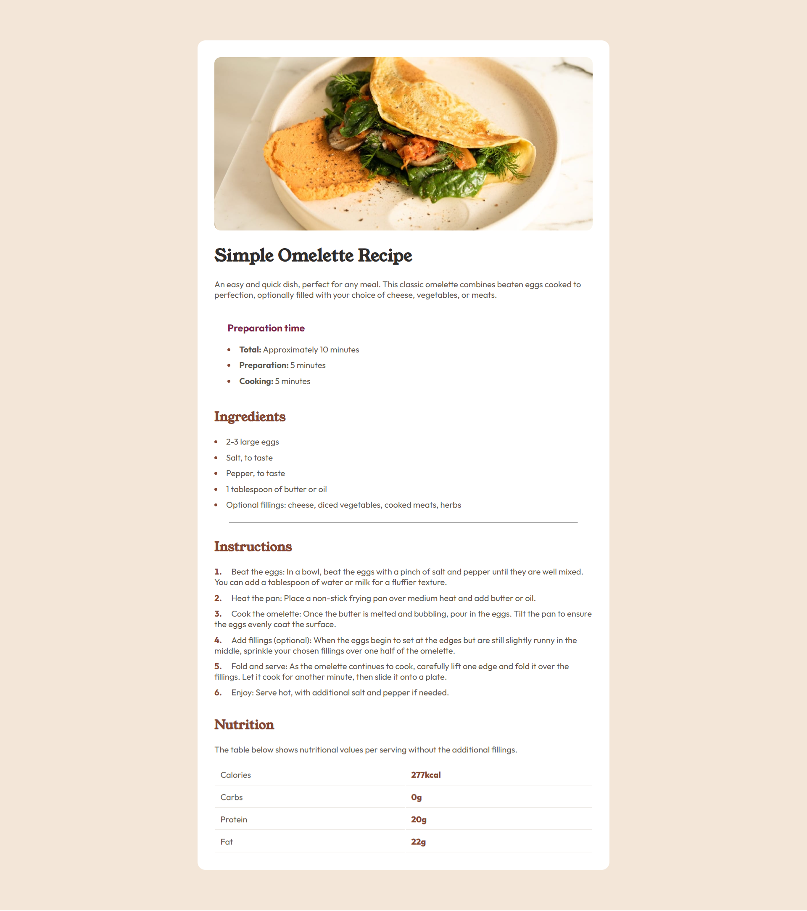

# Frontend Mentor - Recipe page solution

This is a solution to the [Recipe page challenge on Frontend Mentor](https://www.frontendmentor.io/challenges/recipe-page-KiTsR8QQKm). Frontend Mentor challenges help you improve your coding skills by building realistic projects. 

## Table of contents

- [Overview](#overview)
  - [The challenge](#the-challenge)
  - [Screenshot](#screenshot)
  - [Links](#links)
- [My process](#my-process)
  - [Built with](#built-with)
- [Author](#author)
- [Acknowledgments](#acknowledgments)

## Overview

### Screenshot

### Links
### Links

- Solution URL: [Solution URL here](https://www.frontendmentor.io/solutions/frontend-mentor-recipe-page-main-using-html-and-css-gGb43gRlHb)
- Live Site URL: [Live site URL here](https://zzz-ren.github.io/Frontend-mentor-recipe-page-main/)

## My process

### Built with

- Semantic HTML5 markup
- CSS custom properties
- Flexbox
- CSS Grid
- Mobile-first workflow

## Author

- Website - [Dhiren Rathod](https://www.dhiren.thenetnexus.com)
- Frontend Mentor - [@zZz-ren](https://www.frontendmentor.io/profile/zZz-ren)
